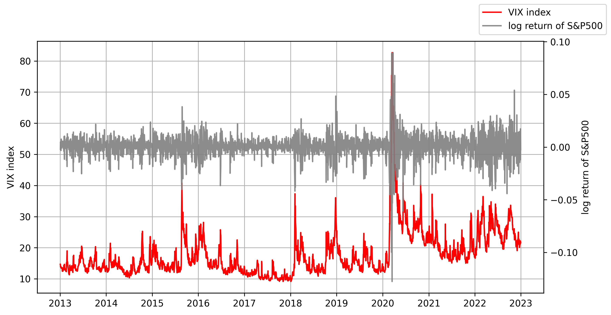
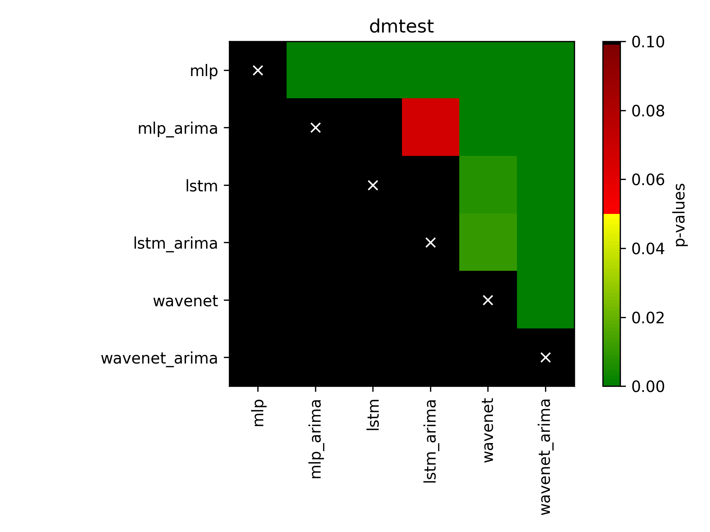

# VIX Index Prediction with S&P 500 Data

This project aims to predict the VIX index using S&P 500 data as the independent variable. The code is implemented in Python and utilizes ARIMA features as additional inputs to improve the prediction results. Additionally, a WaveNet model is compared to MLP and LSTM models for prediction performance.




### Installation

To run the code, you need to install the following libraries:

- python3.8
- matplotlib==3.3.2
- numpy==1.24.1
- pandas==1.5.3
- pytorch_lightning==2.0.1
- scipy==1.5.2
- statsmodels==0.12.0
- torch==2.0.0
- yfinance==0.2.9

You can install these libraries using pip or conda package manager. For example, to install the required libraries using pip, you can run the following command in your Python environment:

```shell
pip install -r requirements.txt
```


### Data
The project uses historical data of the S&P 500 index and VIX index from 2013-01-02 to 2022-12-30.


### Code Structure

The code is organized into the following files:

- `./data/download.py`: This file contains the code for data downloading using yfinance API.
- `./data/preprocess.py`: This file contains the code for data preprocessing, including data cleaning, feature engineering, and data splitting for training and testing.
- `./model/baselines.py`: This file contains the implementation of baselines (e.g. MLP, LSTM).
- `./model/wavenet.py`: This file contains the implementation of the WaveNet model for VIX index prediction.
- `main.py`: This is the main entry point of the program, where the data preprocessing, ARIMA feature extraction, and model training and evaluation are performed.


### Usage

To run the program, you can follow these steps:

1. Install the required libraries as mentioned in the "Installation" section.

2. Run code in the following:

```shell
python main.py --model=wavenet --arima=1
```

### Results

The prediction results are evaluated using appropriate metrics, such as MSE, RMSE, MAE, and MAPE. The results are displayed and logged in the console during the model training process. The comparison of the prediction performance of the WaveNet, MLP, and LSTM models is presented and discussed in the project report.


|               |      mse     |      mae     |     rmse     |     mape     |
|:-------------:|:------------:|:------------:|:------------:|:------------:|
|      mlp      |   18.888565  |   3.733225   |   4.107412   |   0.157731   |
|   mlp + arima   |   6.777174   |   1.920302   |   2.379199   |   0.079372   |
|      lstm     |   5.962223   |   1.760764   |   2.216405   |   0.076254   |
|   lstm + arima  |   5.886991   |   1.720101   |   2.211673   |   0.073815   |
|    wavenet    |   4.668662   |   1.678188   |   2.046593   |    0.07369   |
| wavenet + arima | **3.437923** | **1.426503** | **1.743127** | **0.064706** |


#### Diebold-Mariano (DM) test



You can find more details in the `visualization.ipynb` file.


### Conclusion

In conclusion, this project demonstrates the use of S&P 500 data and ARIMA features for VIX index prediction, and compares the performance of the WaveNet, MLP, and LSTM models. The project provides insights and findings on the effectiveness of ARIMA features and different prediction models for VIX index forecasting, and can be used as a reference for future research in this field.


### References

1. [WaveNet](https://arxiv.org/pdf/1609.03499v2.pdf): Model structures
2. [DM test](https://github.com/jeslago/epftoolbox/blob/master/epftoolbox/evaluation/_dm.py#L155): Codes for Diebold-Mariano (DM) test. (`./utils/metrics.py`)